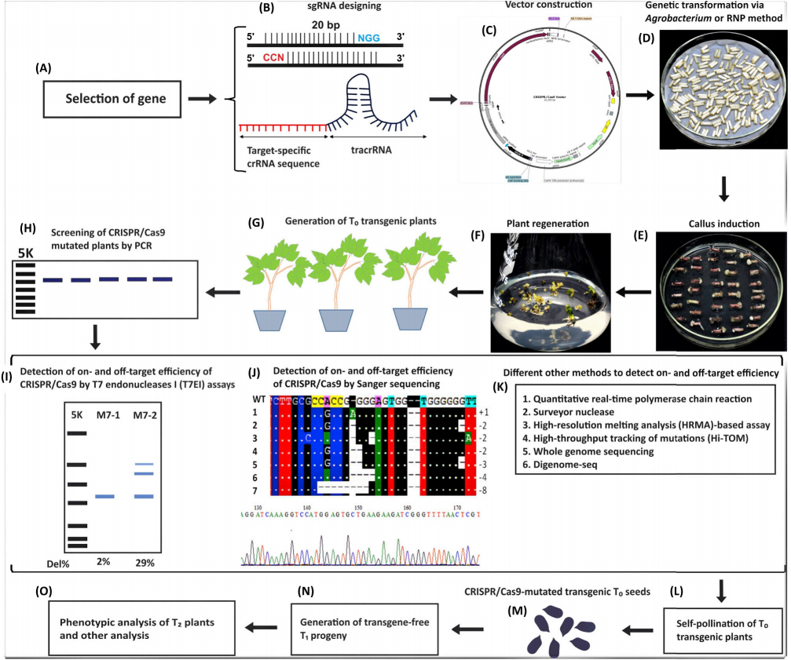

#### 棉花-昆虫互作的分子机制

---

#### CRISPR/Cas System in the cotton genome
- Genome editing (GE) has modernized the biological world by providing a means to edit genomes of living organisms, including humans, plants, animals, and microbes.
- CRISPR/Cas9 is an RNA guided endonuclease targeting the DNA.
- CRISPR/Cas9 has high efficiency, accuracy, and ease of use for GE.
- Until now, the CRISPR/Cas9 system has been the best choice for GE, but despite its extensive use and applications, there are still some limitations to its more widespread application.
- Newly emerging CRISPR/Cas systems (i.e., spCas9-NG, base editing, xCas9, Cpf1, Cas13, Cas14) are now being used for GE.
- Base editing (BE) introduces precise and reproducible nucleotide changes at genomic targets without requiring donor DNA templates, double-stranded breaks (DSBs), or dependency on homology-directed repair (HDR) and nonhomologous end-joining (NHEJ).

Genome editing (GE) has revolutionized biological research through the new ability to precisely edit the genomes of living organisms. In recent years, various GE tools have been explored for editing simple and complex genomes. The clustered regularly interspaced short palindromic repeats (CRISPR)/Cas9 system has widely been used in GE due to its high efficiency, ease of use, and accuracy. It can be used to add desirable and remove undesirable alleles simultaneously in a single event. Here, we discuss various applications of CRISPR/Cas9 in a range of important crops, compare it with other GE tools, and review its mechanism, limitations, and future possibilities. Various newly emerging CRISPR/Cas systems, including base editing (BE), xCas9, and Cas12a (Cpf1), are also considered.

---

#### RNAi和外源抗/杀虫基因在棉花中的应用

---

#### 组学相关生物信息学分析

---

#### 昆虫效应子鉴定